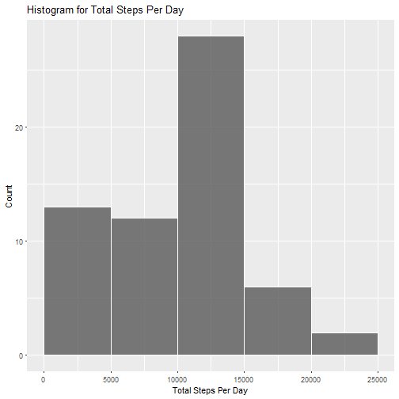
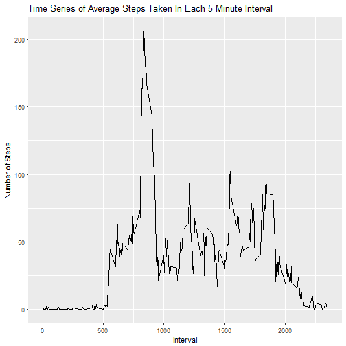
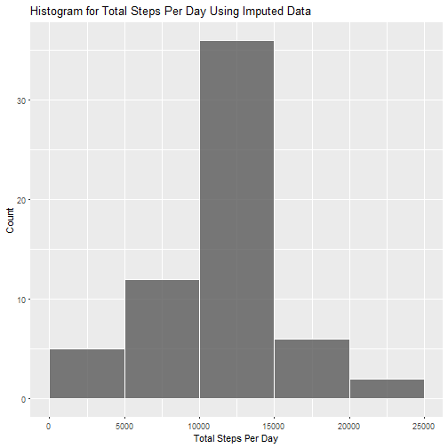
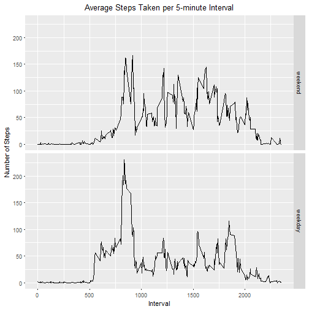

# Reproducible Research: Peer Assessment 1
This document describes the steps taken to produce the results for Course Project 1 of the Reproducible 
Research course.

## Loading and preprocessing the data
*Assumes the data is a file called **activity.csv** in the current working directory*


```r
## load required libraries
library(plyr, quietly = TRUE, warn.conflicts = FALSE)
library(dplyr, quietly = TRUE, warn.conflicts = FALSE)
library(ggplot2, quietly = TRUE, warn.conflicts = FALSE)
library(scales, quietly = TRUE, warn.conflicts = FALSE)

## read in the data
activity <- read.csv('./activity.csv')

## change date field to date class
activity$date <- as.Date(activity$date)
```


## What is mean total number of steps taken per day?


```r
## 1. Calculate the total number of steps taken per day
## (use na.rm to basically use 0 for the number of steps on missing days)
stepsPerDayOriginalData <- activity %>% group_by(date) %>% summarize(totalSteps = sum(steps, na.rm = TRUE))

## 2. Make a histogram of the total number of steps taken each day 
ggplot(data = na.omit(stepsPerDayOriginalData), aes(totalSteps)) + 
        geom_histogram(col = "white", alpha = .8, breaks=seq(0, 25000, by=5000)) + 
        labs(title="Histogram for Total Steps Per Day") + labs(x="Total Steps Per Day", y="Count")
```



```r
## 3. Calculate and report the mean and median of the total number of steps taken per day
round(mean(stepsPerDayOriginalData$totalSteps))
```

```
## [1] 9354
```

```r
median(stepsPerDayOriginalData$totalSteps)
```

```
## [1] 10395
```

## What is the average daily activity pattern?


```r
## Group data by interval and calculate average steps per interval
stepsIntervalOriginalData <- activity %>% group_by(interval) %>% 
        summarize(avgSteps = mean(steps, na.rm = TRUE))

## 1. Make a time series of the 5-minute interval (x-axis) and the average number 
## of steps taken, averaged across all days (y-axis)
ggplot(data = na.omit(stepsIntervalOriginalData), aes(interval, avgSteps)) + 
        geom_line() +
        labs(title="Time Series of Average Steps Taken In Each 5 Minute Interval") +
        labs(x="Interval", y="Number of Steps")
```



```r
## 2. Which 5-minute interval, on average across all the days in the dataset, 
## contains the maximum number of steps?
as.integer(stepsIntervalOriginalData[which.max(stepsIntervalOriginalData$avgSteps),1])
```

```
## [1] 835
```


## Imputing missing values


```r
## 1. Calculate and report the total number of missing values in the dataset
sum(!complete.cases(activity))
```

```
## [1] 2304
```

```r
## 2&3. Fill in missing values with the mean of that interval and
## create a new dataset that is equal to the original dataset but with the missing data filled in.
incompletes <- activity[!complete.cases(activity),] ## get rows with NA values
completes <- activity[complete.cases(activity),] ## gets rows without NA values

## Join the stepsInterval data with the incompletes on the interval field so that 
## incompletes now has a new column with the average steps for that interval. Remove 
## the original steps field (which was all NAs) and rename the avgSteps to just steps. 
activityImputed <- dplyr::select(
        dplyr::rename(
                select(join(stepsIntervalOriginalData, incompletes, by = "interval"), -steps), 
                steps = avgSteps), steps, date, interval)
activityImputed <- rbind(activityImputed, completes) ## join the new imputed data with the complete cases

## Validate results 
## the dimensions of the imputed data matches those of the original activity data 
dim(activityImputed) 
```

```
## [1] 17568     3
```

```r
dim(activity)
```

```
## [1] 17568     3
```

```r
sum(!complete.cases(activityImputed)) ## Number of incomplete cases is now 0
```

```
## [1] 0
```

```r
## Calculate the total number of steps taken per day from the imputed data set
stepsPerDayImputedData <- activityImputed %>% group_by(date) %>% summarize(totalSteps = sum(steps))

## 4a. Make a histogram of the total number of steps taken each day 
ggplot(data = na.omit(stepsPerDayImputedData), aes(totalSteps)) + 
        geom_histogram(col = "white", alpha = .8, breaks=seq(0, 25000, by=5000)) + 
        labs(title="Histogram for Total Steps Per Day Using Imputed Data") + 
        labs(x="Total Steps Per Day", y="Count")
```



```r
## 4b. Calculate and report the mean and median of the total number of steps taken per day
round(mean(stepsPerDayImputedData$totalSteps))
```

```
## [1] 10766
```

```r
round(median(stepsPerDayImputedData$totalSteps))
```

```
## [1] 10766
```

## Are there differences in activity patterns between weekdays and weekends?


```r
## 1. Create a new factor variable in the dataset with two levels
## "weekday" and "weekend"" indicating whether a given date is a weekday or weekend day.
activityImputed$weekdayOrEnd <- factor((
        weekdays(activityImputed$date) %in% c("Monday", "Tuesday", "Wednesday", "Thursday", "Friday")),
                                       levels=c(FALSE, TRUE), labels=c('weekend', 'weekday'))

## Group data by interval and the new variable and calculate average steps over those groups
stepsIntervalImputedData <- activityImputed %>% group_by(interval, weekdayOrEnd) %>% 
        summarize(avgSteps = mean(steps))

## 2. Make a panel plot containing a time series plot of the 5-minute interval (x-axis) and 
## the average number of steps taken, averaged across all weekday days or weekend days (y-axis). 
ggplot(stepsIntervalImputedData, aes(interval, avgSteps)) + geom_line() + 
        facet_grid(weekdayOrEnd ~ .) + 
        ggtitle("Average Steps Taken per 5-minute Interval") +
        theme(plot.title = element_text(hjust = 0.5)) + 
        labs(x = "Interval", y = "Number of Steps")
```




